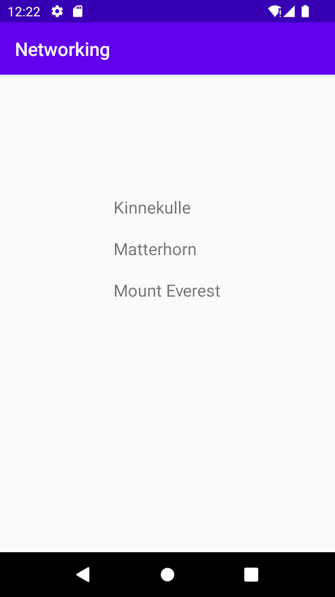

# Rapport

**Skriv din rapport här!**
Jag började med att lägga till en RecycleView till min kod. Detta var 
lite krångligt då jag först inte förstod uppgiftsbeskrivningen till 100%.
Sedan lade jag till en Mountain-klass och en RecycleViewAdapter. I Mountain-
klassen initierade jag variabeln för namnen på bergen. 
Jag ändrade JSON_URL till länken med data vi blev tilldelade. 
Denna länk fungerade hemma och appen visade då namnen på bergen från länken
men i skolan visade den namnen från JSON_FILE på grund av brandväggs-problem.
Nedan följer kodexempel på Mountain-klassen.

```
public class Mountain {
    private String name;


    public Mountain(String name) {
        this.name = name;
    }

    public String getName() {
        
        return name;
    }

    public void setName(String name) {
        this.name = name;
    }

    public String toString() {
        return name;
    }

}
```

Bilder läggs i samma mapp som markdown-filen.



Läs gärna:

- Boulos, M.N.K., Warren, J., Gong, J. & Yue, P. (2010) Web GIS in practice VIII: HTML5 and the canvas element for interactive online mapping. International journal of health geographics 9, 14. Shin, Y. &
- Wunsche, B.C. (2013) A smartphone-based golf simulation exercise game for supporting arthritis patients. 2013 28th International Conference of Image and Vision Computing New Zealand (IVCNZ), IEEE, pp. 459–464.
- Wohlin, C., Runeson, P., Höst, M., Ohlsson, M.C., Regnell, B., Wesslén, A. (2012) Experimentation in Software Engineering, Berlin, Heidelberg: Springer Berlin Heidelberg.
